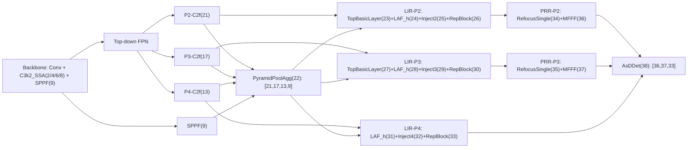

# PRR-v3 改造总结

更新时间：2026-04-24

## 当前主线口径

当前项目的最新结构验证对象是：

`YOLO11-HFAMPAN-AsDDet-NWD-SmallObject-PRR-v3-SSA-P1-NoSAC-FullC2f.yaml`

它不是原始 `PRR-v3`，也不是 `P1-HC64` 或 `P3Fusion`，而是在 `P1`
基础上的双改造变体：

1. `PyramidPoolAgg` 输入从原 P1 的 `[-1, -4, -8, 9]` 改为
   `[21, 17, 13, 9]`，即显式使用 `P2-C2f / P3-C2f / P4-C2f / SPPF`。
2. 删除 `SemanticAlignmenCalibration`，检测头直接使用
   `[P2-MFFF, P3-MFFF, P4-RepBlock]`。

超算 `4.17` 与 `4.20` 均已 dry-run 通过：

- `675 layers`
- `6,004,865 parameters`
- `33.5 GFLOPs`
- 模块命中：`PyramidPoolAgg(22)`、`AsDDet(38)`
- 未出现：`SemanticAlignmenCalibration`

## 逐层结构

### 1. Backbone

主干保留 4 个 `C3k2_SSA` 阶段：

- `2`: shallow，Sobel only
- `4`: mid，Sobel + SAConv(d=2)
- `6`: deep，Sobel + SAConv(d=3)
- `8`: deep，Sobel + SAConv(d=3)

`P5/SPPF` 保留为语义源，但不作为独立检测输出。

### 2. FPN Top-down

`10-21` 是常规 top-down FPN：

- `13`: P4 top-down C2f
- `17`: P3 top-down C2f
- `21`: P2 top-down C2f

这三个 C2f 是后续 FullC2f-PPA 的主要输入。

### 3. FullC2f-PPA

当前 PPA 为：

```yaml
- [[21, 17, 13, 9], 1, PyramidPoolAgg, [512, 2, 'torch']]  # 22
```

含义：

- `21`: P2-C2f，高分辨率小目标细节
- `17`: P3-C2f，小目标/中小目标主尺度
- `13`: P4-C2f，中尺度语义
- `9`: SPPF，高层全局语义

这个改动修正了原 P1 中 `[-1, -4, -8, 9]` 实际引用到部分 `Conv 1x1`
中间层的问题，使 PPA 的输入更接近“全 C2f + SPPF”的设计意图。

### 4. LIR 抽象块

图中的 `LIR` 不是代码里的单个类，而是分支增强链路的抽象名。

P2 分支：

```text
LIR(P2) = TopBasicLayer(23) + LAF_h(24) + InjectionMultiSum_Auto_pool2(25) + RepBlock(26)
```

P3 分支：

```text
LIR(P3) = TopBasicLayer(27) + LAF_h(28) + InjectionMultiSum_Auto_pool3(29) + RepBlock(30)
```

P4 分支：

```text
LIR(P4) = LAF_h(31) + InjectionMultiSum_Auto_pool4(32) + RepBlock(33)
```

注意：P4 分支没有 `TopBasicLayer`，它不是 P2/P3 的完全同构分支。

### 5. PRR 抽象块

当前 `PRR` 也不是单个层名。若作为检测前重聚焦增强段，应定义为：

```text
PRR(P2) = RefocusSingle(34) + MFFF(36)
PRR(P3) = RefocusSingle(35) + MFFF(37)
```

P4 不走 PRR，直接以 `RepBlock(33)` 输入检测头。

### 6. Detect Head

当前检测头为：

```yaml
- [[36, 37, 33], 1, AsDDet, [nc]]  # 38
```

也就是：

- `36`: P2 PRR+MFFF 输出
- `37`: P3 PRR+MFFF 输出
- `33`: P4 LIR 输出

这是一个统一的三尺度 `AsDDet`，不是三个独立的 `P2-Head / P3-Head / P4-Head` 模块。

## 训练策略

当前推荐训练模式仍为 `full`：

```text
full = Scale-Routed Optimizer + Noise-Aware Batch Curriculum + SSDS
```

关键实现状态：

- `small_object_trainer.py` 已在 `_setup_train` 后强制注入 `SSDSDetectionLoss`，
  避免 `model.loss()` 绕过 trainer 的自定义 criterion。
- `optimizer_router.py` 已将小目标结构模块路由到 `small_object` 参数组。
- `refocus_resample.py` 已修复 `grid_sample` 在 AMP 下的 input/grid dtype mismatch。
- `uav.py` 已修复 FFT fp16 尺寸限制，并将 `fac_conv` 输入恢复为原 dtype：
  `x_att = self.fac_conv(self.fac_pool(out))`。

## 当前训练脚本

RS-STOD NoSAC-FullC2f：

```bash
PROJECT_DIR=/share/home/u2415363072/4.20/ultralyticsPro--YOLO11 \
WEIGHTS_PATH=/share/home/u2415363072/4.20/ultralyticsPro--YOLO11/best_pt/yolo11n.pt \
sbatch train_rsstod_prrv3_ssa_p1_nosac_fullc2f_slurm.sh
```

USOD NoSAC-FullC2f：

```bash
PROJECT_DIR=/share/home/u2415363072/4.20/ultralyticsPro--YOLO11 \
sbatch train_usod_prrv3_ssa_p1_nosac_fullc2f_slurm.sh
```

USOD 脚本会运行时生成绝对路径数据 YAML：

`_runtime_data_USOD_420_abs.yaml`

这样可以避免 Ultralytics 全局 `settings.json` 把相对路径拼成
`datasets/datasets/...`。

## 已归档实验事实

以下指标以 slurm `.out` 最终验证行为准，避免 `results.csv` 追加污染。

```text
USOD-s0:        P=0.820  R=0.745  mAP50=0.820  mAP50-95=0.331
USOD-p1:        P=0.833  R=0.749  mAP50=0.821  mAP50-95=0.336
USOD-p2:        P=0.822  R=0.750  mAP50=0.817  mAP50-95=0.327
USOD-HC64:      P=0.783  R=0.695  mAP50=0.759  mAP50-95=0.286
USOD-P3Fusion:  P=0.791  R=0.738  mAP50=0.799  mAP50-95=0.324
RS-STOD-P1:     P=0.701  R=0.642  mAP50=0.687  mAP50-95=0.429
```

结论：

- USOD 当前最强仍是 `P1`，`P2 / HC64 / P3Fusion` 都是负向或未胜出分支。
- `RS-STOD 82809` 是 Phase C 的有效跨数据集结果，但它产于 SSDS 修复前，
  不能作为 SSDS 正向证据。
- `NoSAC-FullC2f` 已完成建图验证，最终性能仍待当前 RS-STOD / 后续 USOD 训练回收。

## 网络结构核验

外部结构依据与当前设计的关系：

1. FPN 论文支持“top-down + lateral connection”构建低成本多尺度语义金字塔，
   这对应当前 FPN + PPA 的基本思路。
2. 小目标增强型 FPN 工作指出，小目标在 top-down 传播和上采样中容易丢失边界与细节，
   因此高层语义与低层上下文的重新融合是合理方向；当前 FullC2f-PPA 正是在降低
   中间 Conv 索引偏差后，让 PPA 直接吃更强 C2f 表征。
3. NWD 论文指出 tiny object 对 IoU 位置偏差高度敏感，NWD 可嵌入 loss/assignment/NMS，
   这支持本项目继续保留 `loss: NWD`。
4. Spatial Transformer 与 Deformable Conv 系列都支持“可学习/可微空间采样”对几何变化建模，
   这给 `RefocusSingle(gridsample)` 的局部重聚焦提供了合理背景。

结构判断：

- `P2/P3/P4` 检测预算重分配是合理的，适合小目标与遥感目标。
- `FullC2f-PPA` 是比原 P1 更干净的语义聚合输入，但会增加 PPA 输入通道，需以实验确认收益。
- 删除 SAC 能降低对齐与 dtype 风险，并减少部分计算路径；代价是 P2/P3 跨尺度校准能力下降。
- 因此 `NoSAC-FullC2f` 是合理的消融/候选主线，但不能在 RS-STOD 与 USOD 结果出来前替代 P1。

参考来源：

- FPN: https://arxiv.org/pdf/1612.03144
- ES-FPN small object: https://www.sciencedirect.com/science/article/pii/S0923596523000012
- NWD tiny object: https://arxiv.org/abs/2110.13389
- P2 small object detection layer: https://pmc.ncbi.nlm.nih.gov/articles/PMC11700085/
- Spatial Transformer Networks: https://arxiv.org/abs/1506.02025
- Deformable Convolutional Networks: https://arxiv.org/abs/1703.06211

## 当前风险边界

1. `NoSAC-FullC2f` 目前只有 dry-run 证据，还没有完整 300 epoch 指标。
2. `results.csv` 在多个历史目录中存在追加污染，最终指标必须优先取 slurm `.out` 最终 val 行。
3. `SSDS` 修复前的结果只能证明结构本身或 A/B 路线，不能证明 SSDS 有效。
4. `4.17/4.20` 两个超算目录需继续保持 `uav.py`、`refocus_resample.py`、
   `small_object_trainer.py` 三文件同步。

## 推荐下一步

1. 等 `RS-STOD NoSAC-FullC2f` 当前作业完成，沉淀正式实验卡。
2. 4.20 空闲后跑 `USOD NoSAC-FullC2f`，用低成本数据集判断是否值得扩到 AI-TOD。
3. 如果 `NoSAC-FullC2f` 任一数据集不弱于 P1，再排 `AI-TOD NoSAC-FullC2f`。
4. 若 RS-STOD 与 USOD 都弱于 P1，则将 `NoSAC-FullC2f` 定位为负向结构消融，不进入主线。

## 严格结构图


